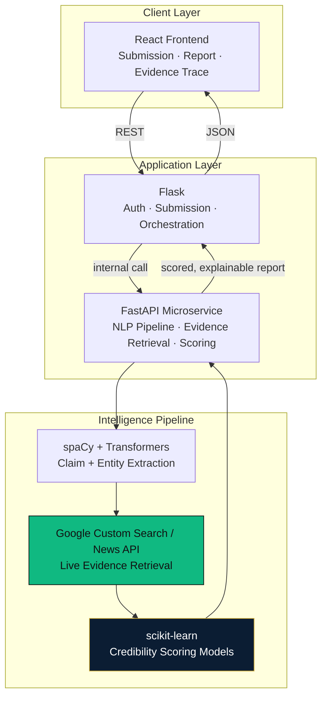
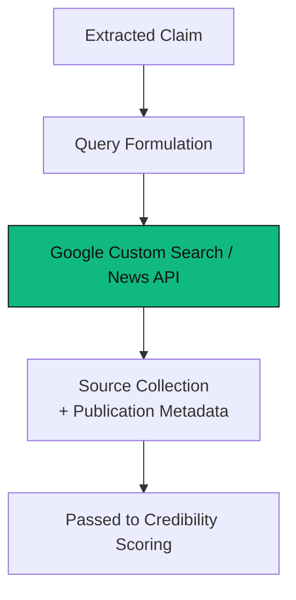

<div align="center">

<!-- ============================================================
  PLACEHOLDER: Replace with a custom-designed SVG wordmark
  (matte-black / evidence-gold wordmark, 1600x400, transparent bg).
============================================================= -->


<br/><br/>

<a href="https://veritas-thenameisbhagavan.vercel.app/">
  
</a>

<br/><br/>


<br/>

<p>
  
  
  
</p>
<p>
  
  
  
  
</p>
<p>
  
</p>

<br/>

<p>
  <a href="https://veritas-thenameisbhagavan.vercel.app/"></a>
  <a href="https://github.com/thenameisbhagavan/veritas"></a>
  <a href="#-system-architecture"></a>
</p>

</div>

<br/>

<div align="center">

**·  ·  ·**

</div>

<br/>

## I · Why Misinformation Exists

<table>
<tr>
<td>

Misinformation doesn't spread because people are careless. It spreads because **verification is expensive and confidence is cheap.** Checking a claim properly means finding independent sources, cross-referencing them, weighing their credibility, and reasoning about what they actually support — work that takes minutes a reader doesn't have, against a claim that took seconds to write.

The asymmetry is structural, not incidental. Every system that doesn't correct for it will keep losing to the same dynamic.

</td>
</tr>
</table>

<br/>

## II · Why Modern AI Is Insufficient

Most "AI fact-checkers" collapse the entire verification problem into a single number — a confidence score, a true/false label — generated by a model reasoning over its own parametric memory. This fails in two specific, avoidable ways:

<table>
<tr><th>Failure Mode</th><th>Consequence</th></tr>
<tr><td>The model answers from what it was trained on, not from current, checkable sources</td><td>Confident answers about claims the model has no real evidence for</td></tr>
<tr><td>The output is a verdict with no visible reasoning chain</td><td>The user has no way to audit *why* the system concluded what it did — trust is demanded, not earned</td></tr>
</table>

<br/>

## III · Why Explainability Matters

<div align="center">

### *"A verification system that can't show its work isn't verification — it's just a second opinion with better production values."*

</div>

<br/>

A credibility score without a reasoning trace is not meaningfully different from a stranger's opinion. **VERITAS is built on the premise that the reasoning path — which claims were extracted, which evidence was retrieved, how each piece of evidence was weighted — is not an optional add-on. It is the product.**

<br/>

## IV · Why Evidence Matters

This is also why VERITAS deliberately does **not** rely on an LLM to generate its verdicts. An LLM asked "is this true" answers from its training distribution — a static, dated, unaudited source. VERITAS instead retrieves **live, external evidence** for every claim and scores credibility against that retrieved evidence — so a conclusion is only ever as strong as the sources backing it, and those sources are always visible.

<br/>


<br/>

## V · The VERITAS Vision

**VERITAS is an Explainable Intelligence Platform** — it takes unstructured text, extracts the claims within it, retrieves independent evidence for each claim, scores credibility against that evidence, and returns a fully traceable reasoning chain, not a verdict handed down from a black box.

<table>
<tr>
<td align="center" width="25%">

**Extract**
<br/>
<sub>Isolate discrete, checkable claims from unstructured text</sub>

</td>
<td align="center" width="25%">

**Retrieve**
<br/>
<sub>Pull live, independent evidence — not model memory</sub>

</td>
<td align="center" width="25%">

**Score**
<br/>
<sub>Weight evidence credibility, not just presence</sub>

</td>
<td align="center" width="25%">

**Explain**
<br/>
<sub>Surface the full reasoning trace behind every score</sub>

</td>
</tr>
</table>

<br/>

## VI · System Architecture



<br/>

## VII · Intelligence Pipeline

```mermaid
flowchart LR
    A["Raw Text Input"] --> B["Claim Extraction<br/>spaCy + Transformers"]
    B --> C["Entity Recognition"]
    C --> D["Evidence Retrieval<br/>Google Search / News API"]
    D --> E["Credibility Scoring<br/>scikit-learn"]
    E --> F["Bias Detection"]
    F --> G["Explainability Engine"]
    G --> H["Report Generator"]

    style B fill:#0B1D33,stroke:#D4AF37,color:#fff
    style E fill:#10B981,stroke:#0A0A0A,color:#111
    style G fill:#D4AF37,stroke:#0A0A0A,color:#111
```



<br/>

## VIII · Claim Extraction

<table>
<tr>
<td width="55%">

**Problem:** Not every sentence in a document is a checkable factual claim — opinions, questions, and hedged statements aren't. Verifying all of them wastes evidence-retrieval budget on things that were never falsifiable to begin with.

**Solution:** A spaCy-based syntactic pass isolates candidate factual assertions; a transformer-based classifier then filters for claims that are specific and checkable, discarding opinion and speculative language before anything reaches the evidence layer.

</td>
<td width="45%">

> [!NOTE]
> **Engineering decision:** extraction is deliberately a two-stage filter (syntactic candidate generation, then classification) rather than a single model call — cheaper syntactic filtering runs first so the more expensive transformer pass only sees plausible candidates.

</td>
</tr>
</table>

<br/>

## IX · Entity Recognition

Named entities within each extracted claim — people, organizations, dates, locations, figures — are tagged so evidence retrieval can be scoped precisely. A claim about "unemployment in Q3 2025" and a claim about "unemployment" in general should not be verified against the same evidence set; entity tagging is what makes that distinction possible.

<br/>

## X · Evidence Engine

<table>
<tr>
<td width="55%">

Retrieves live, independent evidence for each extracted claim via the **Google Custom Search / News API** — not from a static or pre-indexed corpus, and not from a model's training data. Each claim is issued as a targeted query, and returned sources are collected alongside their publication metadata for downstream credibility weighting.

**Why this matters:** a verification system whose evidence base doesn't update is making the same category of error it's meant to catch — asserting something as current when it may no longer be true.

</td>
<td width="45%">



</td>
</tr>
</table>

<br/>

## XI · Credibility Scoring

Retrieved evidence is not treated as uniformly trustworthy. A **scikit-learn**-based scoring model weighs each source against features including source diversity, agreement across independent sources, and publication recency — and produces a credibility score for the claim as a function of its evidence, not as an isolated model judgment.

> [!TIP]
> A claim supported by three independent, agreeing sources is scored differently than one supported by three re-publications of a single original source — the scoring model is designed to detect and discount the latter.

<br/>

## XII · Explainability Engine

<table>
<tr>
<td>

This is the subsystem that makes VERITAS a research-grade platform rather than another opaque classifier. For every credibility score produced, the Explainability Engine reconstructs and exposes the full reasoning path: which claim was extracted, which entities anchored it, which sources were retrieved, how each source was weighted, and how those weights combined into the final score.

**Research value:** because every stage of the pipeline persists its intermediate output, the reasoning trace is not reconstructed after the fact from logs — it is a first-class artifact generated alongside the score itself.

</td>
</tr>
</table>

<br/>

## XIII · Bias Detection

Evidence sources are also screened for editorial lean and framing bias, so a credibility score isn't inadvertently built on a set of sources that all share the same blind spot. Bias signal is surfaced in the report as context for interpreting the evidence — not used to silently discard sources, since a biased source can still contain accurate factual content.

<br/>

## XIV · Report Generator

Synthesizes claim, evidence, credibility score, and bias signal into a single structured report — the reasoning trace made legible, not just logged. This is the artifact a user actually reads: not a bare score, but the evidence chain that produced it.

<br/>


<br/>

## XV · Dashboard Preview

<div align="center">

<!-- PLACEHOLDER: replace with a real screen capture of a VERITAS analysis report -->


<sub>▲ Placeholder — record a walkthrough of a real claim submission → evidence trace → report and replace this GIF.</sub>

</div>

<br/>

## XVI · Frontend & Backend Architecture

<table>
<tr>
<td width="50%" valign="top">

#### Frontend Architecture
**React**, structured around a submission-to-report flow: text/claim input, a live pipeline-status view during processing, and a report surface that renders the evidence trace as a navigable structure rather than a wall of text.

</td>
<td width="50%" valign="top">

#### Backend Architecture
**Flask** owns submission handling and orchestration; the **NLP/ML pipeline and evidence retrieval are isolated in a FastAPI microservice**, so the compute-heavy transformer inference and external API calls (Google Search/News) can be scaled and rate-limited independently of the core application.

</td>
</tr>
</table>

<br/>

## XVII · Technology Stack

<div align="center">


</div>

<br/>

<table align="center">
<tr><th>Layer</th><th>Technology</th><th>Purpose</th></tr>
<tr><td><b>Frontend</b></td><td>React</td><td>Claim submission, live pipeline status, evidence-trace report view</td></tr>
<tr><td><b>Application Backend</b></td><td>Flask</td><td>Submission handling, auth, orchestration</td></tr>
<tr><td><b>Intelligence Microservice</b></td><td>FastAPI</td><td>NLP pipeline, evidence retrieval, scoring — isolated for independent scaling</td></tr>
<tr><td><b>NLP</b></td><td>spaCy, Hugging Face Transformers</td><td>Claim extraction, entity recognition</td></tr>
<tr><td><b>Credibility Modeling</b></td><td>scikit-learn</td><td>Evidence-weighted credibility scoring — no LLM in the scoring path</td></tr>
<tr><td><b>External Evidence</b></td><td>Google Custom Search / News API</td><td>Live, independent evidence retrieval per claim</td></tr>
<tr><td><b>Hosting</b></td><td>Vercel</td><td>Production deployment</td></tr>
</table>

<br/>

> [!NOTE]
> VERITAS deliberately does not use an LLM for claim scoring or verdict generation — credibility is a function of retrieved evidence and a scikit-learn scoring model, not a language model's parametric judgment. This is a core design choice, not a limitation: see §II–§IV.

<br/>

### Folder Structure

```
veritas/
├── client/                      # React frontend
│   └── src/
│       ├── components/           # Submission form, pipeline status, report view
│       ├── pages/
│       └── services/               # API client layer
├── server/
│   ├── flask_app/                 # Auth, submission endpoints, orchestration
│   └── intelligence_service/       # FastAPI microservice
│       ├── extraction/              # spaCy + Transformers claim/entity extraction
│       ├── evidence/                 # Google Search/News API integration
│       ├── scoring/                   # scikit-learn credibility models
│       ├── explainability/             # Reasoning trace assembly
│       └── main.py
├── requirements.txt
└── package.json
```

> [!NOTE]
> **Placeholder** — confirm this matches your actual repo layout before publishing; adjust to your real package structure.

<br/>

## XVIII · Security

- Google Search/News API keys held server-side only — never exposed to the React client
- Claim submissions should be rate-limited to prevent evidence-API quota exhaustion from abuse
- Model artifacts (scikit-learn scoring models) versioned separately from application code

> [!WARNING]
> **Placeholder** — confirm actual data retention policy for submitted text and generated reports before publishing.

<br/>

## XIX · Performance & Scalability

| Concern | Approach |
|---|---|
| **Transformer inference latency** | Isolated FastAPI microservice, independently scalable from the Flask request path |
| **External API rate limits** | Evidence retrieval results cached per claim signature to avoid redundant Google Search/News calls |
| **Pipeline throughput** | Two-stage claim extraction (cheap syntactic filter before expensive transformer pass, §VIII) keeps per-document cost proportional to actual claim density |

<br/>

## XX · Roadmap

- [x] Claim Extraction (spaCy + Transformers)
- [x] Evidence Engine (live Google Search / News API)
- [x] Credibility Scoring (scikit-learn)
- [x] Explainability Engine + Report Generator
- [ ] Multi-language claim extraction
- [ ] Source-credibility reputation tracking over time
- [ ] Batch/document-level verification (beyond single-claim submission)

<br/>

## XXI · Contributing

1. Fork the repository and create a feature branch (`feat/your-feature`)
2. If touching the scoring model, document the features it consumes and retrain/validate before submitting
3. Any new pipeline stage must persist intermediate output for the Explainability Engine — see §XII
4. Open a PR describing the reasoning-quality impact, not just the code diff

<br/>

## XXII · Developer

<div align="center">

**Bhagavan** — [@thenameisbhagavan](https://github.com/thenameisbhagavan)

<a href="https://thenameisbhagavan.vercel.app/"></a>
<a href="https://linkedin.com/in/bhagavan"></a>
<a href="https://github.com/thenameisbhagavan"></a>

</div>

<br/>

## XXIII · License

Distributed under the **MIT License**. See [`LICENSE`](./LICENSE) for details.

<br/>


<div align="center">
<sub>Every score, traceable to its evidence. — <b>VERITAS</b></sub>
</div>
